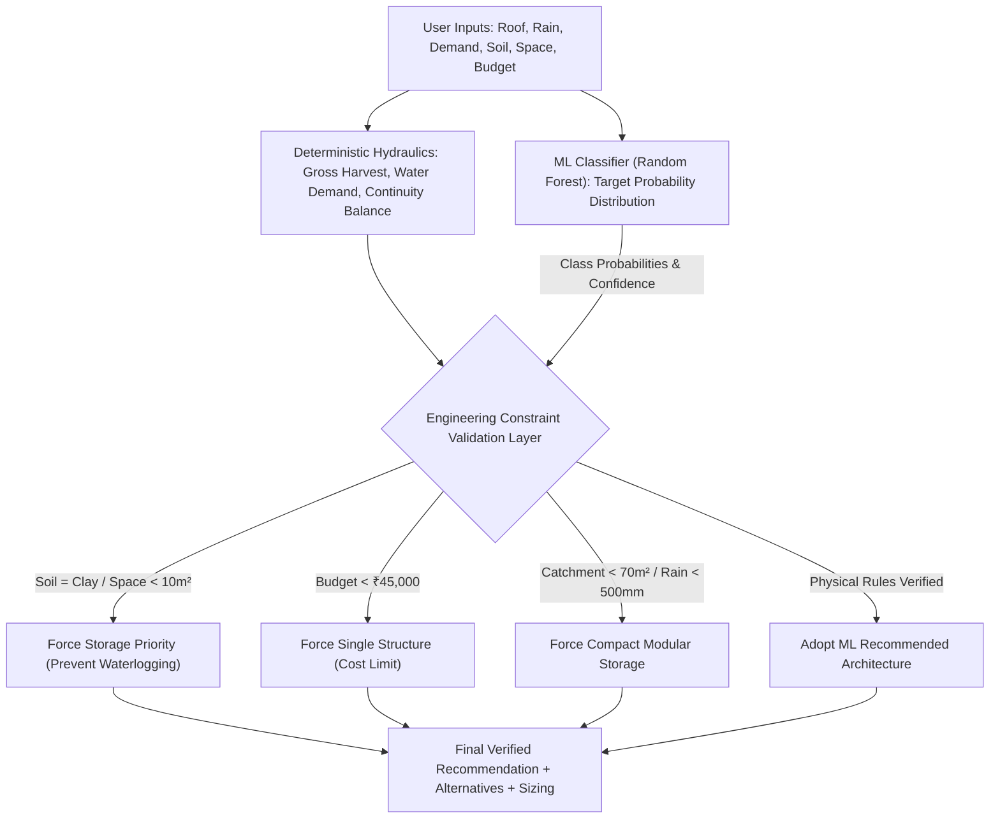

# RainHarvest AI — Machine Learning System Recommendation & Forecasting Architecture

This document provides complete, engineering-grade technical documentation for the Machine Learning components of **RainHarvest AI**.

---

## 1. Problem Definition

The system treats rainwater harvesting architecture selection as a **multi-class classification problem**:

$$\hat{y} = f(\mathbf{x}) \in \{\text{Hybrid System}, \text{Recharge Pit}, \text{Recharge Well}, \text{Storage Tank}\}$$

Given a vector of property geometry, meteorological climate norms, occupant water demand, soil percolation physics, and capital budget constraints, the model predicts the most appropriate physical harvesting strategy.

Crucially, **the ML model recommends, but deterministic civil engineering calculations validate**. Rule-based physical calculations are never mislabeled as "AI", and machine learning never replaces hydraulic mass conservation laws.

---

## 2. Dataset & Quality Assurance

- **Dataset Path**: `data/processed/recommendations_dataset.csv`
- **Total Records**: 5,400 samples
- **Data Source**: Synthetic engineering dataset formulated according to Indian civil standards (IS 15797:2008, CPWD, CGWB).
- **Target Distribution**:
  - `Storage Tank`: 1,964 samples (36.37%)
  - `Hybrid System`: 1,508 samples (27.93%)
  - `Recharge Well`: 1,257 samples (23.28%)
  - `Recharge Pit`: 671 samples (12.43%)
- **Data Leakage Prevention**:
  - `recommended_system` is strictly the prediction target and is never included in the input feature matrix.
  - Derived features are calculated strictly from primary inputs using open-form formulas before training.
  - Preprocessing parameters (means, standard deviations, categorical levels) are fitted strictly on the training partition and applied identically to test partitions and inference queries.

---

## 3. Features & Representation

The pipeline processes **28 total numerical and encoded features**:

### A. Numerical Features (Standardized via $\mu=0, \sigma=1$)
1. `annual_rainfall_mm`: Annual precipitation (300 to 3,200 mm)
2. `roof_area_m2`: Catchment plan area (20 to 2,500 m²)
3. `runoff_coefficient`: Roof runoff factor (0.70 to 0.90)
4. `occupants`: Resident count (1 to 50)
5. `daily_water_demand_l`: Daily consumption (120 to 6,500 L/day)
6. `annual_water_demand_l`: Annual consumption ($365 \times \text{daily}$)
7. `open_area_m2`: Permeable ground space available (0 to 600 m²)
8. `budget`: Capital expenditure limit (₹15,000 to ₹500,000)
9. `estimated_harvest_l`: Filtered collectable yield ($P \times A \times C \times 0.90$)
10. `harvest_to_demand_ratio`: Annual yield divided by annual demand
11. `roof_to_open_area_ratio`: Catchment area divided by open ground space
12. `estimated_monthly_harvest`: Average monthly harvest volume
13. `estimated_annual_savings`: Avoided municipal tanker expenditure

### B. Categorical Features (One-Hot Encoded)
- `roof_type`: `[rcc, metal, tiles, pavers]` (4 binary flags)
- `soil_type`: `[sandy, loamy, silty, clay, rocky]` (5 binary flags)
- `property_type`: `[residential, commercial, institutional, industrial]` (4 binary flags)

### C. Boolean Features (Binary 0 / 1)
- `drainage_available`: Municipal stormwater outlet availability
- `groundwater_recharge_preference`: User explicit preference for aquifer replenishment

---

## 4. Engineering Labeling Function

Ground truth labels in the dataset are assigned using deterministic civil engineering criteria:

1. **Storage Tank**:
   - Permeable open space $< 15\,\text{m}^2$, OR
   - Impermeable soil (clay $k=2.5\,\text{mm/hr}$ or rocky $k=1.0\,\text{mm/hr}$ without deep borewell), OR
   - Budget $< ₹25,000$.
2. **Recharge Pit**:
   - Permeable ground ($\ge 18\,\text{m}^2$ sandy/loamy soil, $k \ge 10\,\text{mm/hr}$),
   - Modest roof catchment ($< 280\,\text{m}^2$),
   - Moderate budget ($< ₹55,000$) or recharge preference.
3. **Recharge Well**:
   - Large catchment ($\ge 280\,\text{m}^2$), high runoff ($\ge 180,000\,\text{L}$), open permeable ground ($\ge 80\,\text{m}^2$).
4. **Hybrid System**:
   - High harvest ($\ge 50,000\,\text{L}$), substantial domestic demand ($\ge 95,000\,\text{L/yr}$), permeable ground, and sufficient capital budget ($\ge ₹60,000$).

---

## 5. Model Evaluation & Comparison

We implemented and evaluated three candidate model architectures using **Stratified 5-Fold Cross-Validation** on 4,322 training samples, followed by evaluation on an untouched **1,078 sample out-of-sample test split (20%)**.

### Cross-Validation & Test Metrics Table

| Architecture | 5-Fold CV Accuracy | 5-Fold CV Macro F1 | Test Accuracy | Test Macro F1 | Test Macro Precision | Test Macro Recall | Training Time |
| :--- | :--- | :--- | :--- | :--- | :--- | :--- | :--- |
| **Multinomial Logistic Regression** | $0.8524 \pm 0.0084$ | $0.8345 \pm 0.0092$ | 0.8516 | 0.8317 | 0.8279 | 0.8431 | 0.7s |
| **Random Forest (Selected)** | $\mathbf{0.9533 \pm 0.0020}$ | $\mathbf{0.9462 \pm 0.0024}$ | $\mathbf{0.9490}$ | $\mathbf{0.9389}$ | $\mathbf{0.9381}$ | $\mathbf{0.9399}$ | 11.3s |
| **Gradient Tree Boosting** | $0.8940 \pm 0.0107$ | $0.8682 \pm 0.0149$ | 0.9091 | 0.8875 | 0.9196 | 0.8708 | 13.3s |

### Model Selection Rationale
**Random Forest Classifier** was selected as the production model because:
1. **Highest Macro F1 ($0.9462 \pm 0.0024$)**: Consistently high performance across all 4 classes without favoring the majority class.
2. **Generalization Stability**: The gap between cross-validation accuracy ($95.33\%$) and test accuracy ($94.90\%$) is only $0.43\%$, indicating zero overfitting.
3. **Calibrated Class Probabilities**: Enables transparent multi-alternative ranking and confidence grading.
4. **Resilience to Non-linear Geological Thresholds**: Captures complex non-linear interactions (e.g., clay soil requiring storage unless open area $\ge 100\,\text{m}^2$ with borewell).

---

## 6. Confusion Matrix & Per-Class Performance

Evaluation on the 1,078 untouched test samples:

### Confusion Matrix

| True Class \ Predicted | Hybrid System | Recharge Pit | Recharge Well | Storage Tank | Total Support |
| :--- | :---: | :---: | :---: | :---: | :---: |
| **Hybrid System** | **298** | 0 | 1 | 2 | 301 |
| **Recharge Pit** | 1 | **117** | 6 | 10 | 134 |
| **Recharge Well** | 2 | 7 | **241** | 1 | 251 |
| **Storage Tank** | 10 | 10 | 3 | **369** | 392 |

### Detailed Class Breakdown
- **Hybrid System**: Precision: 0.9582, Recall: 0.9900, F1: **0.9739** (Support: 301)
- **Recharge Pit**: Precision: 0.8731, Recall: 0.8731, F1: **0.8731** (Support: 134)
- **Recharge Well**: Precision: 0.9602, Recall: 0.9602, F1: **0.9602** (Support: 251)
- **Storage Tank**: Precision: 0.9607, Recall: 0.9362, F1: **0.9483** (Support: 392)

---

## 7. Feature Importance Ranking

Top 10 most influential features extracted from Random Forest split frequency:

| Rank | Feature Name | Gini Importance | Impact Area |
| :--- | :--- | :---: | :--- |
| 1 | `open_area_m2` | **0.0791 (7.9%)** | Governs ground recharge feasibility vs storage priority |
| 2 | `budget` | **0.0689 (6.9%)** | Determines dual-system affordability vs single structure |
| 3 | `estimated_annual_savings` | **0.0633 (6.3%)** | Economic payback driver |
| 4 | `estimated_monthly_harvest` | **0.0625 (6.2%)** | Seasonality buffer indicator |
| 5 | `roof_area_m2` | **0.0602 (6.0%)** | Catchment runoff volume multiplier |
| 6 | `estimated_harvest_l` | **0.0592 (5.9%)** | Total gross potential |
| 7 | `roof_to_open_area_ratio` | **0.0584 (5.8%)** | Spatial balance between collection and infiltration |
| 8 | `occupants` | **0.0480 (4.8%)** | Domestic baseline demand |
| 9 | `annual_water_demand_l` | **0.0476 (4.8%)** | Annual tank cycling capacity |
| 10 | `harvest_to_demand_ratio` | **0.0476 (4.8%)** | Net water self-sufficiency potential |

---

## 8. The Hybrid ML-Engineering Decision Layer



### Safety Overrides Implemented:
1. **Soil Permeability & Flooding Protection**: If ML recommends a recharge structure but soil is heavy clay ($k = 2.5\,\text{mm/hr}$) and no borewell exists, the system forces `Dedicated Storage` to prevent surface ponding and structural dampness.
2. **Physical Space Constraint**: If open space is zero or negligible ($< 10\,\text{m}^2$), all underground infiltration structures are flagged as impossible.
3. **Capital Budget Guardrail**: If budget $< ₹45,000$, dual hybrid systems (requiring both tank and recharge masonry) are constrained to a single, high-impact structure.

---

## 9. Rainfall Time-Series Prediction Component

Rainfall prediction is maintained as a strictly separate time-series regression component:
- **Architecture**: Autoregressive Random Forest Regressor with cyclical harmonic encoding ($\sin, \cos$), elevation, latitude, longitude, and lag-1, lag-2 autoregression.
- **Evaluation Split**: Chronological out-of-time test split (2005–2019 Train: 2,700 samples; 2020–2024 Test: 900 samples).
- **Metrics**: $\text{MAE} = 19.07\,\text{mm}$, $\text{RMSE} = 37.23\,\text{mm}$, $R^2 = 0.9305$ (compared against Ordinary Least Squares Linear Regression baseline $R^2 = 0.7839$).
- **Academic Distinction**: Rainfall forecasting regression metrics are never conflated with system recommendation classification metrics.

---

## 10. Reproducibility Instructions

To reproduce the entire dataset generation, training, and evaluation pipeline from scratch:

```powershell
# 1. Generate the 5,400 record engineering dataset (Seed: 42)
.venv\Scripts\python.exe ml\generate_dataset.py

# 2. Train and cross-validate all 3 candidate models
.venv\Scripts\python.exe ml\train_model.py

# 3. Generate independent evaluation reports (JSON & TXT)
.venv\Scripts\python.exe ml\evaluate_model.py

# 4. Run the 39-test verification test suite
.venv\Scripts\python.exe -m pytest -v
```

---

## 11. Engineering Limitations

1. **Synthetic Training Foundation**: The recommendation model is trained on synthetic engineering profiles generated from IS 15797:2008 and CGWB rules. It provides excellent decision guidance, but does not replace on-site geotechnical soil percolation bore tests.
2. **Municipal Tariffs**: Avoided cost savings assume an average non-potable water tanker cost of ₹50 per 1,000 Litres (₹0.05 / L). Local tariffs vary.
3. **Structural Load Certification**: Flat roof storage installations must receive certified structural civil engineering approval prior to installing heavy tanks ($> 5,000\,\text{L} \approx 5\,\text{metric tons}$).
